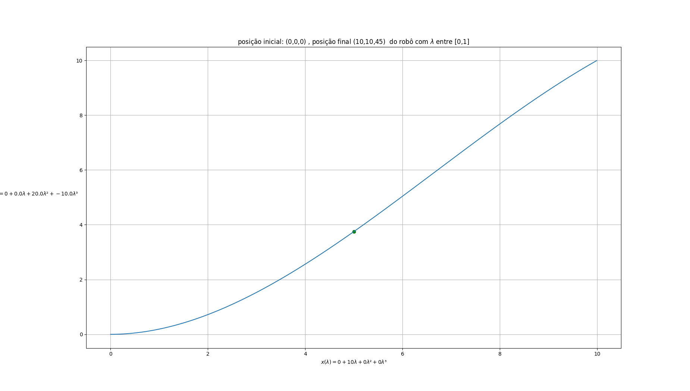
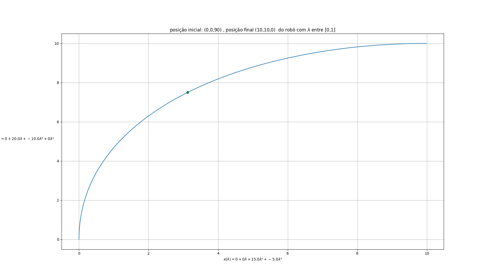

# controle cinemático sistemas autonomos UFRN

Esse sistema está organizado da seguinte forma:

- controladores (controllers)
- coppeliasim
- main.py

todo controlador deve ficar na pasta [controllers](controllers), toda nova função do simulador (CoppeliaSim) deve ser
colocada na pasta coppeliasim e se não sabe aonde colocar o seu código, coloque no [utils](utils).

- **OS CONTROLADORES NÃO DEVEM CONHECER AS FUNÇÕES DO SIMULADOR**

- É no arquivo **main.py** que os dados vindos do simulador são enviados para os controladores.
- caso precisarmos adicionar um novo modulo, então o modulo deve se comunicar através do arquivo **main.py**


### Observações
Para executar esse passo a passo, foi utilizado:
- _python_ na sua versão __3.10__
- _Coppeliasim_ na sua versão __V4.2.0 rev5__
- instale as dependências do projeto:

```shell
pip install -r requirements.txt
```

## Passos para executar a aplicação

0. instale as dependências

1. abra o coppeliasim, e abra a [simple_scene.ttt](simple_scene.ttt)  
   File -> open scene... >

2. inicialize a simulação, clicando no ícone do PLAY

3. execute a aplicação em python:

```shell
python main.py
```

### Testes

#### visualizar testes de gerador de polinômios

```shell
# certifique-se de estar na pasta raiz do projeto
python tests/plot_path.py 
```


### Gráficos dos polinómios cúbicos

#### Caso normal



### Quando a posição final e inicial é próxima a 90


### Quando somente a posição inicial é próxima a 90


### Quando somente a posição final é próxima a 90

