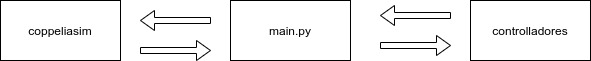

# controle cinemático sistemas autonomos UFRN

Esse sistema está organizado da seguinte forma:

- controladores (controllers)
- coppeliasim
- main.py

todo controlador deve ficar na pasta [controllers](controllers), toda nova função do simulador (CoppeliaSim) deve ser
colocada na pasta [coppeliasim](coppeliasim), muito provavelmente no arquivo [coppeliasim.py](coppeliasim/coppeliasim.py)
e se não sabe aonde colocar o seu código, coloque no [utils](utils).

- **OS CONTROLADORES NÃO DEVEM CONHECER AS FUNÇÕES DO SIMULADOR**

- É no arquivo **main.py** que os dados vindos do simulador são enviados para os controladores.
- caso precisarmos adicionar um novo modulo, então o modulo deve se comunicar através do arquivo **main.py**




### Observações
Para executar esse passo a passo, foi utilizado:
- _python_ na sua versão __3.10__
- _Coppeliasim_ na sua versão __V4.2.0 rev5__
- instale as dependências do projeto:

```shell
pip install -r requirements.txt
```

## Passos para executar a aplicação

0. instale as dependências

1. abra o coppeliasim, e abra a [simple_scene.ttt](simple_scene.ttt)  
   File -> open scene... >

2. inicialize a simulação, clicando no ícone do PLAY

3. execute a aplicação em python:

```shell
python main_braitenberg.py # testar o controlador braitenberg
```

```shell
python main_frederico.py # para testar o controlador de Posição Frederico
```

```shell
python main_path_follow.py # para testar o controlador Frederico com gerador de trajetórias
```

### Testes

[Gráficos do gerador de caminhos](gerador_de_caminhos_plot.md)


## Demonstração do gerador de caminhos no CoppeliaSim
[](https://youtu.be/eXVkFRJU0hI)


## Demonstração do Controlador de Posição Frederico
[](https://youtu.be/OEe0XtFPN4g)


## Demonstração do Controlador Frederico com gerador de trajetórias
[](https://youtu.be/pNImd-6fzWw)


