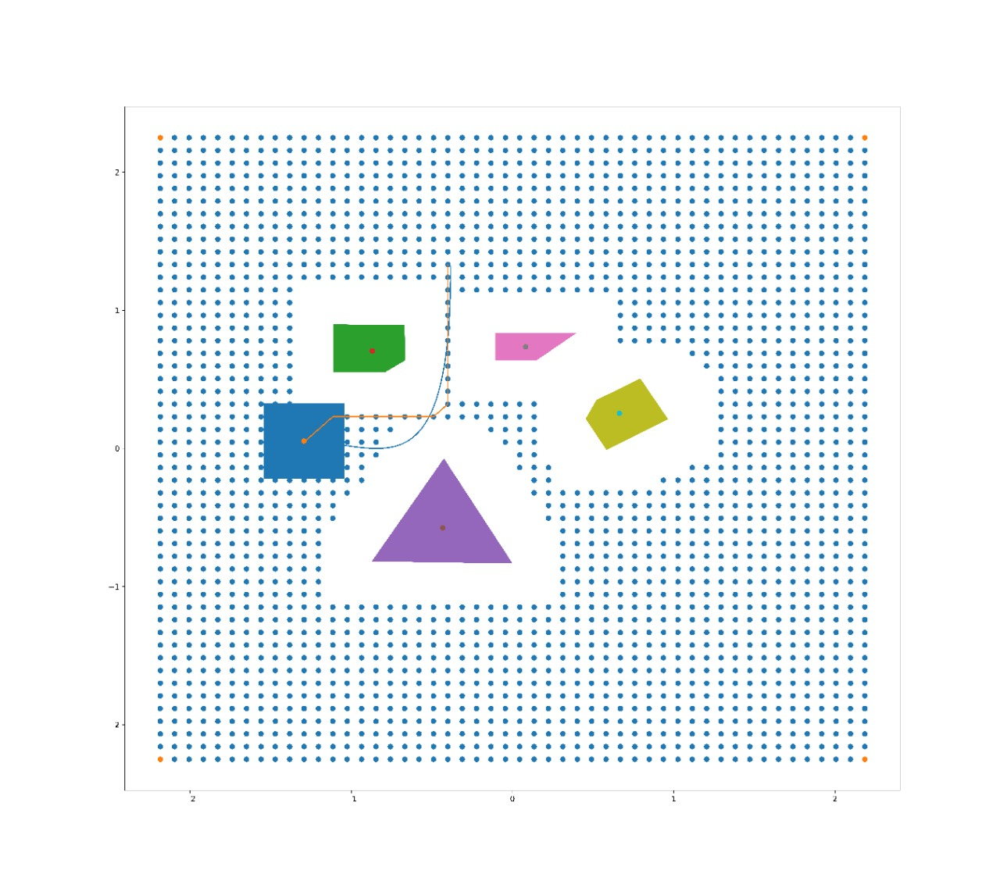

# SEGUNDO PROJETO DE SISTEMAS ROBÓTICOS AUTÔNOMOS

Desenvolver Planejadores de Caminhos para Robô Móvel que
permitam ao mesmo executar movimentos especificados em espaço
povoado de obstáculos, sem colidir com os mesmos.

## Metas

1. Incluir obstáculos poligonais no espaço de trabalho simulado
no V-Rep. O simulador deve apresentar na tela os obstáculos
no espaço de trabalho. Considerando que o robô seja de forma
octogonal e sua orientação não mude, obter o mapa
correspondente em espaço de configuração. Incluir
funcionalidade que apresente o caminho do robô no espaço de
trabalho e no espaço de configuração. Entregar relatório, e
vídeo mostrando as novas funcionalidades implementadas.

2. Implementar planejador de caminhos baseado em grafos para o
robô móvel. A sua implementação deve permitir mostrar o
caminho gerado, tanto no espaço de trabalho do V-Rep, como
no espaço de configuração. Implementar controlador que
permita ao robô seguir o caminho planejado. Entregar relatório
e vídeo mostrando o robô seguindo o caminho planejado.

3. Implementar planejador de caminhos baseado em campos de
potenciais para o robô móvel. A sua implementação deve
permitir mostrar o caminho gerado, tanto no espaço de
trabalho do V-Rep, como no espaço de configuração.
Apresentar gráfico também com a função de potencial
calculada. Implementar controlador que permita ao robô seguir
o caminho planejado. Entregar relatório e vídeo mostrando o
robô seguindo o caminho planejado.

[Relatório Segundo Projeto](Relatorio_segundo_projeto_sistemas_roboticos_autonomos.pdf)

### Testes

## Caminho no espaço de trabalho

## Caminho no espaço de Configuração

## Caminho gerado pela A* no Espaço de trabalho

## Caminho gerado pela A* no Espaço de Configuração

## Controlador Federico Seguindo Caminho gerado pela A* no Espaço de Trabalho

## Controlador Federico Seguindo Caminho gerado pela A* no Campo Potencial Artificial 

### Referências

mapeamento de obstáculos para espaço de configuração [notes on configuration space](../docs/notes_on_configuration_space.md)
