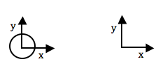
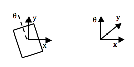
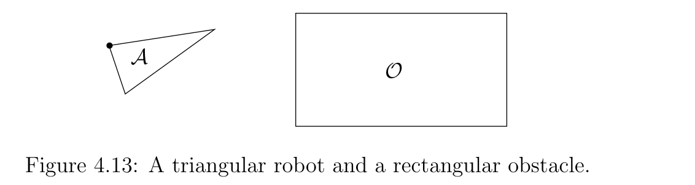
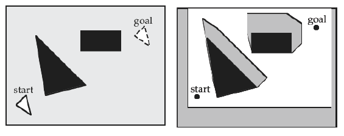
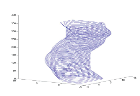

## Comp150-07: Intelligent Robotics Notes on Configuration Space

For a robot to navigate its environment to a goal position without colliding with obstacles, it can plan a motion _path_ through the environment. The robot has a footprint (it occupies a region of its _workspace_) and degrees of freedom that define its possible motions. To plan a path in the workspace, it would need to plan the motion of every point of its shape according to its degrees of freedom. This may be reduced to planning the vertices of a polygonal (or polyhedral) shaped robot, but that remains a hard problem: the
robot would need to make sure, at every point in its computed path,that its footprint does not intersect the obstacles.

A much easier problem is to plan a path for a single point in any space. So the solution is to reduce the robot to a point, and represent the obstacles in such a way that representing the robot as a point makes sense. This means, planning a path for a point in robot's _configuration space_ (aka _c-space_) rather than the workspace.

### Configurations and c-space

The robot's configuration space is the set of all allowed (possible) robot configurations. What is a robot configuration? It is the precise specification of all of the robot's degrees of freedom (DOFs). Here are some examples (in pictures, on the left: robot DOFs, on the right: c-space dimensions).

<table>
    <tbody>
      <tr valign="middle">
        <td align="left">
          A planar, circular omni-drive robot has 2 degrees of freedom: (x,y). Therefore,
          its configuration space is &real;2.
        </td>
        <td>
          
        </td>
      </tr>
      <tr valign="middle">
        <td>
          A planar odometry robot capable of translation and rotation has 3
          degrees of freedom: (x,y,&theta;). Therefore, its configuration space
          will be three-dimensional, where dimensions 1 and 2 are real, and
          dimension 3 is toroidal (wrapping on itself like a donught) with point
          coordinates between 0 and 360 degrees.
        </td>
        <td> 
        </td>
      </tr>
      <tr valign="middle">
        <td>
          A planar 2-link arm robot fixed at the based and with two revolute
          (rotational) joints, one at the base, and one at the elbow, has 2 DOFs
          (one for each joint): (&theta;1, &theta;2). Its
          configuration space will
          be a 2D toroidal space where dimension 1 corresponds to possible
          &theta;1 angles (from 0 to 360) and dimension 2 corresponds
          to possible &theta;2 angles (from 0 to 360).
        </td>
        <td> 
        </td>
      </tr>
    </tbody>
  </table>

### Obstacles in c-space

How do we represent workspace obstacles in c-space? The insight is that a workspace obstacle is a region of space (a set of points) which corresponds to robot configurations that are not possible (or not allowed). An obstacle in c-space is just such a region in c-space: the set of points that are not legal configurations.

For the planar omni-drive robot above, an obstacle in c-space is a set of (x,y)-positions of the robot that are not allowed (because the robot would be colliding with an obstacle if it tried to achieve that position). For the planar robot that is capable of rotation, it is the set of (x,y)-positions at every orientation angle &theta; that correspond to collisions with obstacles. For the 2-link arm robot, it is the set of all joint angles (&theta;1,&theta;2)
that correspond to collisions with obstacles.

### Constructing c-space obstacles

For a planar robot capable of translation in both x and y directions,
but not of rotation (the 2D omni-drive robot), the intuition is
simple: we pick a reference point on the robot and swipe the robot
around the workspace obstacle while tracing out the reference
point. Then in c-space that reference point will represent our robot.

Formally, points are vectors in &real;2 with coordinates
(x,y). Regions of space are sets and subsets of points, e.g., if the
workspace has boundaries it is a subset of &real;2: W
&sub; &real;2. We define addition for sets
as follows:  
A &oplus; B = {a + b | a &isin;; A, b &isin;; B}  
where a,b &isin;; &real;2, so can be added etc. as
vectors. Similarly for subtraction.

Let the robot or other moving object be denoted by set A, and the
obstacle or stationary object be denoted by set B. We define an
arbitrary reference point on A and a local coordinate system. The
_configuration space obstacle produced by B relative to A_
is:  
COA(B) = {(x,y) &isin; W | (x,y) &oplus; A &cap; B
&ne; 0}  
The configuration space obstacle is the set of workspace points such
that when you add all of the robot points to them, they will intersect
the workspace obstacle. This is exactly our intuitive definition.

This definition isn't very useful for construction purposes, but it
can be rewritten as:   
COA(B) = &cup;</text>x &isin; B(x -
A)  
Or, in English: the union (the totality) of all points we get by
substracting all of the points in A from all points inside of B. This
is equivalent to adding all of the points in -A, which leads to a
construction algorithm.

If both A and B are convex, then the above equation is equivalent to  
COA(B) = convexhull({v - A | v is a vertex of B}).
 
The convex hull of a set of points is the minimum convex set that
encompasses all points in the original set. If you think of each point
in the set as a peg poking out from the ground, and you stretch a
rubber band around all of the pegs, the rubber band is the boundary of
the convex hull.

So, here is our algorithm for computing the configuration space
obstacles for a convex robot A capable of translational motion only in a 2D
workspace W with convex obstacle B:

<table>
    <tbody>
      <tr valign="middle">
        <td align="left">
        </td>
        <td align="left">
        </td>
      </tr>
    </tbody>
</table>

1. Pick a local coordinate system on A including an origin point. This will be the reference point on the robot.

2. Reflect (flip) A about the origin of its local coordinate system (to get -A).

3. Attach -A at every vertex of B to compute the vertices of the resulting shape B &oplus; -A.
   
4. Compute the convex hull of the set of the resulting vertices

The convex hull can be computed with the [gift wrapping algorithm](https://en.wikipedia.org/wiki/Gift_wrapping_algorithm).

Now you can plan a path for the reference point in the c-space, and it will correspond to a collision-free path for the robot in the workspace.

What if A and B are not convex? You can treat them as the union of convex sub-parts, compute the c-space obstacle subsets for each of the sub-parts, then take the union of the c-space obstacle subsets.

#### Orientation DOF and c-space

For a planar robot with DOFs for both position (x,y) and orientation (&theta;), a configuration is a point in 3D space, whose third dimension is toroidal with coordinates between 0 and 360 degrees. C-space obstacles for such a robot will look like "columns" of 2D c-space "slices", where each such "slice" corresponds to the robot shape relative to the workspace when it is oriented at a particular angle &theta;. These columns will have complicated, non-polyherdral shapes, but can be approximated with a number of projection "slices" at a resolution necessary for the robot control.

### References

- Steven LaValle (2006) Planning Algorithms, [Chapter 4: The Configuration Space](http://planning.cs.uiuc.edu/node123.html)

- Tomas Lozano-Perez (1983) [Spatial Planning: A Configuration Space Approach](https://ieeexplore.ieee.org/stamp/stamp.jsp?arnumber=1676196&amp;isnumber=35224), IEEE Transactions on Computers, C-32(2) (full text available through Tufts libraries or on campus)  

- original text: https://www.cs.tufts.edu/comp/150IR/hw/cspace.html

 <address>Paulina Varshavskaya, paulina at cs.tufts.edu, with materials
    by Rodney Brooks and Daniela Rus.</address>

